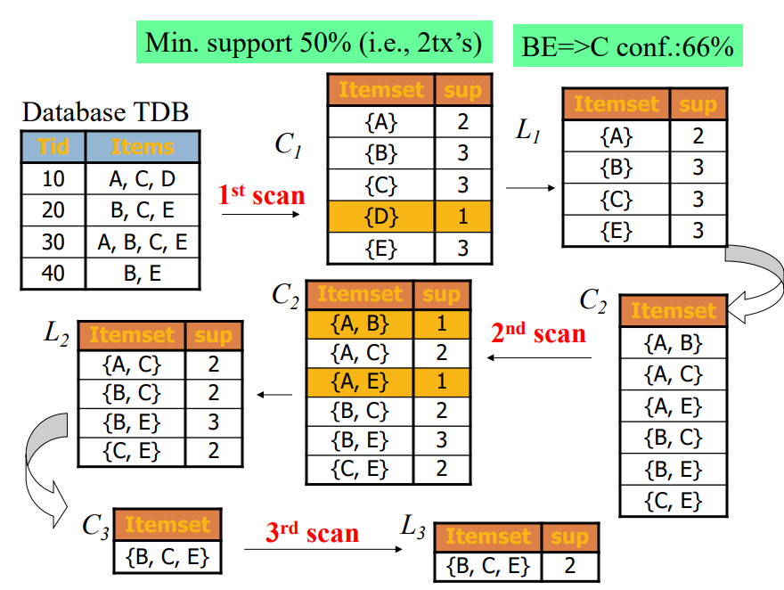

```{r setup, include=FALSE}
knitr::opts_chunk$set(echo = TRUE, warning = FALSE, message = FALSE)
```

源码地址：https://github.com/hao203/blog/tree/master/_posts/2021-03-14-Apriori

# 关联规则理论

## 什么是关联分析

### 啤酒与尿布

在美国有婴儿的家庭中，通常是母亲在家中照看婴儿，父亲去超市为婴儿购买尿布。当丈夫在为孩子购买尿布的同时，也通常购买自己爱喝的啤酒。因此，沃尔玛超市发现这一规律后，将啤酒与尿布放在相同的区域，使得父亲可以同时买到这两件商品，从而提高啤酒与尿布的销售量。

关联分析又被称为购物篮分析（market basket analysis）

关联性不代表因果关系，e.g.尿布$\rightarrow$啤酒

---

### 关联分析及关联规则定义


---

实际上，超市这种销售的行为不是偶然的，而是长期从顾客的大量订单中分析,从而得出的结论。关联分析，就是从大规模数据中，发现对象之间隐含关系与规律的过程，也称为关联规则分析。例如，{啤酒$\rightarrow$尿布}就是一个关联规则。

Association rules analysis is a technique to uncover how items are associated to each other.

---

### 应用场景

  -   超市购物分析
  -   图书购买分析
  -   服装搭配分析
  -   交通事故分析
  -   医学数据分析
  -   社交关系分析

### In medicine

Relationships between symptoms and illnesses; diagnosis and patient characteristics and treatments (to be used in medical DSS); and genes and their functions (to be used in genomics projects)…


## 一些概念

###　事物库（数据集）dataset

+-------------------------+--------------------------------------------+
|  TID                    | Items                                      |
+=========================+============================================+
| **1**                   | **Bread, Milk**                            |
+-------------------------+--------------------------------------------+
| **2**                   | **Bread, Diaper, Beer, Eggs**              |
+-------------------------+--------------------------------------------+
| **3**                   | **Milk, Diaper, Beer, Coke**               |
+-------------------------+--------------------------------------------+
| **4**                   | **Bread, Milk, Diaper, Beer**              |
+-------------------------+--------------------------------------------+
| **5**                   | **Bread, Milk, Diaper, Coke**              |
+-------------------------+--------------------------------------------+

如同上表所示的二维数据集就是一个购物篮事务库。该事物库记录的是顾客购买商品的行为。这里的TID表示一次购买行为的编号，items表示顾客购买了哪些商品。

事务库中的每一条记录被称为一笔事务。在上表的购物篮事务中，每一笔事务都表示一次购物行为。

---

### 项集-Itemset

苹果，香蕉等每一个水果对象，都是一个项。

而一个或更多水果(项)构成的集合,就是项集。例如，{葡萄}, {香蕉，梨}都是项集。

**Itemset**

-   A collection of one or more items
    -   Example: {Milk, Bread, Diaper}

-   k-itemset
    -   An itemset that contains k items
    
---

### 支持度计数-Support count ($\sigma$)

项集在事务中出现的次数。例如，｛Bread，Milk｝这个项集在事务库中一共出现了3次，那么它的支持度计数就是3。

### 支持度-Support(s)

包含项集的事务在所有事务中所占的比例：，这里N是所有事务的数量。上面的例子中我们得到了{Bread，Milk}这个项集的支持度计数是3，事物库中一共有5条事务，那么{Bread，Milk}这个项集的支持度就是3/5 (60%)。

  -   Fraction of transactions that contain an itemset

  -   E.g.   s({Milk, Bread, Diaper}) = 2/5

> X $\rightarrow$ Y :  s = $\frac{\sigma (X)}{N}$ = $\frac{count(X)}{N}$

---

### 频繁项集 - Frequent Itemset

如果我们对项目集的支持度设定一个最小阈值，那么所有支持度大于这个阈值的项集就是频繁项集。

  -   An itemset whose support is greater than or equal to a min(s) threshold
  
The set of frequent k-itemsets is commonly denoted by $L_K$.

---

### 置信度-Confidence(c)

关联规则的置信度定义为：这个定义确定的是Y在包含X的事务中出现的频繁程度。还是看｛Bread，Milk｝→{Diaper}这个例子，包含｛Bread，Milk｝项的事务出现了2次，包含｛Bread，Milk，Diaper}的事务也出现了2次，那么这个规则的置信度就是1。

>  X $\rightarrow$ Y :  c = P(Y|X) = $\frac{s(X,Y)}{s(X)}$ = $\frac{count(X,Y)}{count(X)}$

---

### 例子

Example of Rules:

-   {Milk,Diaper}$\rightarrow${Beer} (s=0.4, c=0.67)
-   {Milk,Beer} $\rightarrow$ {Diaper} (s=0.4, c=1.0)
-   {Diaper,Beer}$\rightarrow${Milk} (s=0.4, c=0.67)
-   {Beer}$\rightarrow${Milk,Diaper} (s=0.4, c=0.67) 
-   {Diaper} $\rightarrow$ {Milk,Beer} (s=0.4, c=0.5) 
-   {Milk}$\rightarrow${Diaper,Beer} (s=0.4, c=0.5)

## Summary

Are all association rules interesting and useful?

A Generic Rule:  X $\rightarrow$ Y [S%, C%]  

-   X, Y: products and/or services  
-   X: Left-hand-side (LHS)
-   Y: Right-hand-side (RHS)
-   S: Support: how often X and Y go together
-   C: Confidence: how often Y go together with the X

## 这两个度的意义在哪里？

对于关联规则定义这两个度量很有意义的。首先，通过对规则支持度（s）的限定滤去没有意义的规则。我们从商家的角度出发，数据挖掘意义是通过挖掘做出相应的战略决策产生价值。如果一个规则支持度很低，说明顾客同时购买这些商品的次数很少，商家针对这个规则做决策几乎没有意义。其次，置信度（c）越大说明这个规则越可靠。

Association rules are considered interesting if they satisfy both 

-   a minimum support threshold and 
-   a minimum confidence threshold.

---

### Lift 提升度

$Lift = \frac{Confidence}{Expected\ Confidence} = \frac{P\left(X \cap Y\right)}{P\left(X\right).P\left(Y\right)} = \frac{c\left(X \rightarrow Y\right)}{s\left(Y\right)} = \frac{P(Y|X)}{P(Y)}$

如果该值等于 1 ,说明两个条件没有任何关联。如果小于 1 ,说明 X 与 Y是负相关的关系，意味着一个出现可能导致另外一个不出现。大于 1 才表示具有正相关的关系。一般在数据挖掘中当提升度大于3 时,我们才承认挖掘出的关联规则是有价值的。

他可以用来评估一个出现提升另外一个出现的程度。

提升度是一种比较简单的判断手法，实际中受零事务（也即不包含 X 也不包含 Y 的事务）的影响比较大。所以如果数据中含有的零事务数量较大，该度量则不合适使用。

# Apriori Algorithm

## Association rule mining: Two-step process

1.    Find all frequent itemsets

  -   By definition, each of these itemsets will occur  at least as frequently as a predetermined minimum support count, min_sup.

2.    **Generate strong association rules** from the frequent itemsets

  -   By definition, these rules must satisfy minimum support and minimum confidence.

## Step 1 第一步的困局

A frequent itemset is an itemset whose support  is ≥ minsup.

一个看似简单的问题，实质要耗费巨大的计算量。

Frequent itemset generation is still **computationally expensive**


Given d items, there are $2^d$ possible candidate itemsets

如果有d件商品，那么有$2^d - 1$种排列组合。

对象之间任意组合构成的项集,数可能非常大。例如，在图中, 4个不同的对象(项)，就可以构成15种组合。而耐于含有N个对象
的数据集，若item种类稍大最终筛选的itemset就是`天文数字`，指数增长。所以我们迫切需要一种算法，能减少计算量。

## 我们今天的主角———Apriori算法

### 原则

>
  - All subsets of a frequent itemset must be frequent(Apriori propertry).
  - If an itemset is infrequent, all its supersets will be infrequent.
  
  -   频繁项集的所有子集都必是频繁的（Apriori属性）。
  -   如果一个项集是不频繁的，那么它的所有超集都是不频繁的。

---


---

Apriori算法会从k = 1开始,使用两个k项集进行组合,从而产生k + 1项集。结给之前介绍的算法原理，我们可知，频繁k + 1项集是由两个k项集组合而成，而耐于频繁k + 1项集来说，所有的k项集子集必然都是频繁项集，这就意味着,频繁k +1项集只可能从两个频繁项集组合产生,因此，当我们在组合的过程中，一旦发现某个k项集不是频繁项集(支持度小于指定的阈值)，就可以将其移除，无需再参与后续生成k + 1项集的组合。这样一来,就可以大大减少计算量。

---

### 流程


Apriori算法流程如下:

  1.  扫描数据集，从数据集中生成候选k项集$C_K$(k从1开始)

  2.  计算$C_K$中,每个项集的支接，删除低于阈值的项集，构成频繁项集$L_K$。

  3.  将频繁项集$L_K$中的元素进行组合,生成候选k + 1项集$C_{K+1}$

  4.  重复步骤2,3,倒满足以下两个条件之-时,算法结束。
    
      -   频繁k项集无法组合生成候选k + 1项集。

      -   所有候选k项集支度都低于指定的阈值(最忮持渡)，无法生成频繁k项集。

---



## Step 2 生成关联规则

当产生频繁项集后，成关联规则会相对简单。我们只需要将每个频繁项集拆分成两个非空子集，然后使用这两个子集，就可以构成关联规则。当然，-个频繁项集拆分两个非空子集可能有很多种方式，我们要考海种不同的可能。例如,频繁项集{1, 2, 3}可以拆分为:

{1 -> 2,3}

{2-> 1,3}

{3-> 1, 2}

{1,2-> 3}

{1,3-> 2}

{2,3-> 1}

然后,我们针对每一个关联规则， 分别计算其置信度,仅保留符合最小置信度的关联规则。


## 参考文献

https://www.youtube.com/watch?v=0CB0Upqeh-o

https://www.bilibili.com/video/BV1Kt4y1X7dZ

https://rpubs.com/Argaadya/network-analysis-for-association-rules

https://medium.com/@yolandawiyono98/market-basket-analysis-with-r-8001417a8e29

# Code

## read data and library the packages

```{r results = 'hide'}
library(tidyverse)
library(arules)
library(arulesViz)
library(kableExtra)
library(rmarkdown)
herbs <- read_csv('test.csv')
herbs[] <- lapply(herbs, as.logical)
herbs <- as(herbs,"transactions")
```

## 寻找频繁项集（Find all frequent itemsets）

```{r results='hide'}
rules <- apriori (herbs,  parameter = list(maxlen=3, supp =0.1, conf = 0.5))
rules_df <- inspect(rules)

```

```{r echo=FALSE}
rules_df %>% 
 paged_table()
```

```{r}
summary(rules)
```


## 按要求排序

###　按置支持度

```{r results='hide'}
rules_s <- sort(rules, by="supp", decreasing=TRUE) %>% 
 inspect() 

```

```{r echo=FALSE}
rules_s %>% 
 paged_table()

```

---

### 按置信度

```{r results='hide'}
rules_c <- sort(rules, by="conf", decreasing=TRUE)  %>% 
 inspect()  

```

```{r echo=FALSE}
rules_c %>% 
 paged_table()

```

## 可视化

### 散点图

```{r}
plot(rules)
plot(rules, method = "grouped")
```

---

### 关系图
```{r}
rules_c <- sort(rules, by="conf", decreasing=TRUE) %>% 
head(.,10) %>% 
plot(.,method="graph")

rules_s <- sort(rules, by="supp", decreasing=TRUE) %>% 
head(.,10) %>% 
plot(.,method="graph")
```

